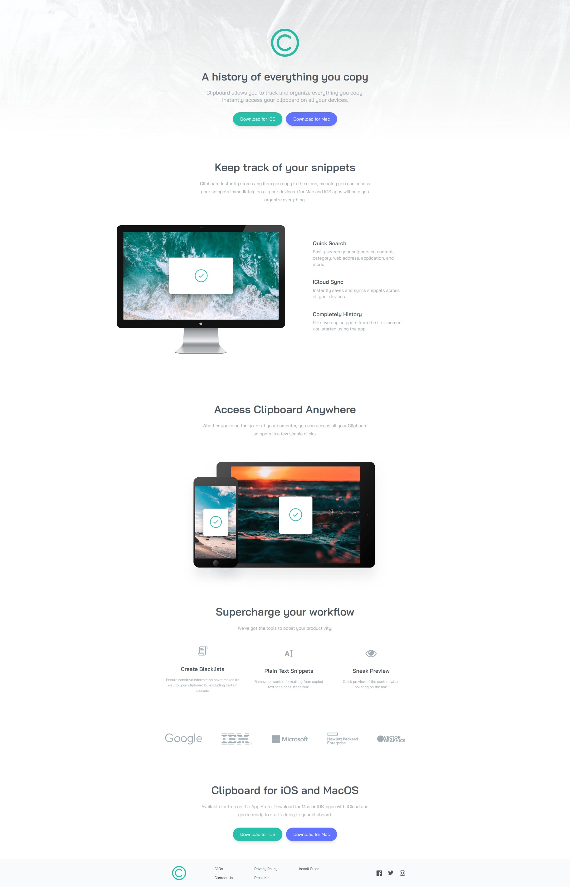

# Frontend Mentor - Clipboard landing page solution

This is a solution to the [Clipboard landing page challenge on Frontend Mentor](https://www.frontendmentor.io/challenges/clipboard-landing-page-5cc9bccd6c4c91111378ecb9). Frontend Mentor challenges help you improve your coding skills by building realistic projects.

## Table of contents

- [Overview](#overview)
  - [The challenge](#the-challenge)
  - [Screenshot](#screenshot)
  - [Links](#links)
- [My process](#my-process)
  - [Built with](#built-with)
  - [Continued development](#continued-development)
  - [Useful resources](#useful-resources)
- [Author](#author)
- [Acknowledgments](#acknowledgments)

**Note: Delete this note and update the table of contents based on what sections you keep.**

## Overview

### The challenge

Users should be able to:

- View the optimal layout for the site depending on their device's screen size
- See hover states for all interactive elements on the page

### Screenshot

### Links

- Solution URL: [https://www.frontendmentor.io/solutions/clipboard-landing-page-yx86adZbYq](https://www.frontendmentor.io/solutions/clipboard-landing-page-yx86adZbYq)
- Live Site URL: [https://zesty-pika-4f05d1.netlify.app/](https://zesty-pika-4f05d1.netlify.app/)

## My process

### Built with

- Semantic HTML5 markup
- Tailwind CSS
- Flexbox
- Mobile-first workflow

### Continued development

I would like to continue my focus on making responsive websites. I would also like to learn more about Tailwind CSS and how to use it more efficiently.

### Useful resources

- [Tailwind CSS From Scratch](https://www.traversymedia.com/tailwind-css-course) - Traversy Media's Tailwind CSS course was very helpful in learning the basics of Tailwind CSS. I'd recommend it to anyone who is just starting out with Tailwind CSS.
- [Tailwind Docs](https://tailwindcss.com) - The Tailwind Docs are very helpful when you need to look up a class name or a utility. I would recommend using the docs as a reference when you are working on a project.

## Author

- Frontend Mentor - [@sean-birmingham](https://www.frontendmentor.io/profile/sean-birmingham)
- Twitter - [@THEHYDRA98](https://www.twitter.com/thehydra98)

## Acknowledgments

I would like to thank Traversy Media for their Tailwind CSS course. It was very helpful in learning the basics of Tailwind CSS!
